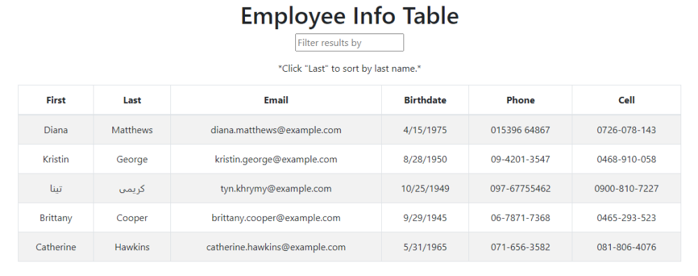

# Employee Directory

# Description

<!-- Some wording taken from instructions readme -->

This is an employee directory that allows the user to be able to view an entire employee directory at once, filter employees by name, and sort employees by last name.

## Screenshot

## Deployed App

[Deployed_App](https://manter-user-directory.herokuapp.com/)

## Table of Contents

[Installation](#Installation)

[Usage](#Usage)

[Questions](#Questions)

## Installation

Deployed on Heroku.
This project was bootstrapped with [Create React App](https://github.com/facebook/create-react-app).

## Usage

<!-- Taken from instructions README -->

The user is able to:

- Sort the table by at least one category

- Filter the users by at least one property.

## Questions

Contact me with any feedback or questions through GitHub or by email.

- [GitHub](https://github.com/smanter82)

- Email: sarahmanter@gmail.com

Some code on this application may have been done in collaboration with my Bootcamp study group classmates: https://github.com/arensalmela, https://github.com/dmaysteinman, https://github.com/EddiePhi, https://github.com/ReindeerCode, https://github.com/DustinErwin, https://github.com/Ewager1, https://github.com/mdjonestwo, https://github.com/shannonquinn91/Note-Taker, https://github.com/JesalDM
